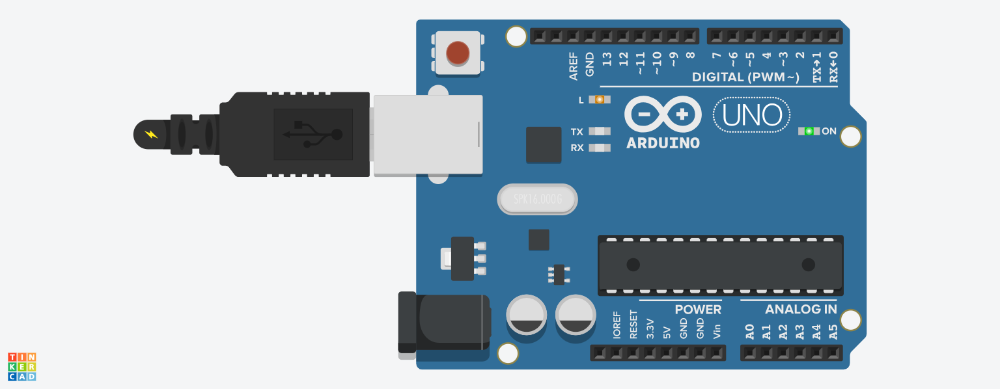
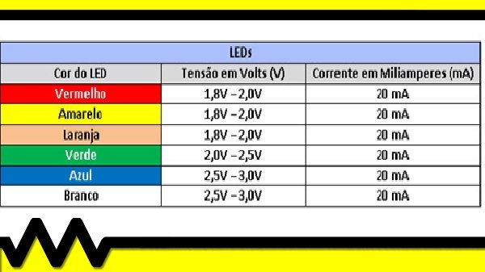
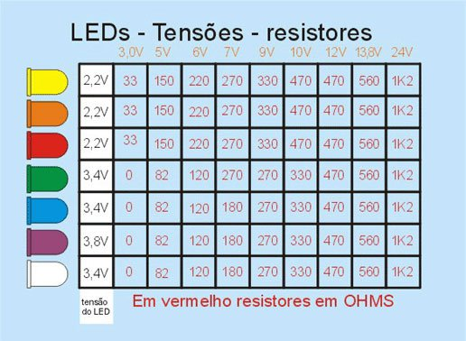

# 🚀 Projeto Básico de Pisca-Pisca Led da IUB (basico-01-pisca-pisca-led)

<div align="center">

[](https://www.arduino.cc/)
[](https://institutouniversal.com.br)

</div>

---

Este projeto consiste na montagem e programação de um circuito oscilador simples para piscar um LED (Light Emitting Diode). Desenvolvido como a primeira lição prática do curso de Eletrônica do Instituto Universal Brasileiro (IUB) para compreender os conceitos de temporização, resistores de limitação de corrente e portas digitais.

*   **Link do Projeto:** [Tinkercad](https://www.tinkercad.com/things/ddJeV7VgXkR-basico-01-pisca-pisca-led)




---

## 📈 Status de Evolução do Projeto
- [x] ☁️ **Fase 1:** Simulação inicial concluída no Tinkercad.
- [x] 🤖 **Fase 2:** Programação e Firmware escritos na IDE do Arduino.
- [ ] 💻 **Fase 3:** Simulação avançada validada (Proteus/LTspice/Falstad).
- [ ] 📐 **Fase 4:** Diagrama esquemático e layout de placa PCI desenhados (KiCad/EasyEDA).
- [ ] 🛠️ **Fase 5:** Montagem física na bancada e testes com componentes reais.

---

## 📂 Estrutura de Arquivos deste Repositório

```text
📂 basico-01-pisca-pisca-led/
├── 📂 01-tinkercad/
│   ├── 📄 link.txt
│   └── 📄 print_circuito.png
├── 📂 02-simulacao/
├── 📂 03-diagramas-pci/
├── 📂 04-firmware/
│   └── 📁 arduino/
├── 📂 05-midia-e-dados/
└── 📄 README.md
```

---

## 🛠️ Tecnologias e Softwares Utilizados

*   **Simulação Virtual:** [Tinkercad](https://tinkercad.com)
*   **Ambiente de Programação:** [Arduino IDE](https://arduino.cc)
*   **Linguagem:** C++ (Wiring do Arduino)

---

## 📝 Descrição Detalhada por Fase

### ☁️ 1. Protótipo Virtual (Tinkercad)
*   **Link do Projeto:** [Clique aqui para acessar meu circuito no Tinkercad](./01-tinkercad/link)
*   *O que foi feito:* O circuito foi montado virtualmente utilizando uma placa Arduino Uno, um LED e um resistor. O objetivo desta etapa foi validar a pinagem e garantir que o resistor calculado estivesse protegendo o LED contra queima por sobrecorrente.

### 🤖 2. Firmware e Lógica de Programação (Arduino)
*   O código-fonte principal `.ino` está localizado dentro da pasta `04-firmware/arduino/`.
*   *Lógica utilizada:* O programa configura o pino digital (ex: Pino 13) como saída (`OUTPUT`). Dentro do laço principal (`loop`), a porta é colocada em nível lógico alto (`HIGH`) por 1000 milissegundos e, em seguida, em nível lógico baixo (`LOW`) por mais 1000 milissegundos, criando o efeito de pisca-pisca contínuo.

---

## 📋 Lista de Componentes Principais (BOM)

| Quantidade | Componente | Descrição / Valor |
| :--- | :--- | :--- |
| 1 | Placa de Desenvolvimento | Compatível com Arduino Uno R3 |
| 1 | Resistor | 220Ω ou 330Ω (Limitador de corrente) |
| 1 | LED | Vermelho de 5mm |
| - | Jumpers | Cabos de conexão |

---

## 🚨 Limitação de Tensão e Corrente em LEDs

Dadas as limitações de corrente e tensão no Led e necessário em muitos casos adcicionar um reistor em série para a correta limitação.

**Valores Típicos:**

*Tensão no Resistor:*

$Vr = Vt - V(led)$

$Vr = 6\;V - 1,8\;V = 4,2\;V$


*Valor da Resistência:*


$R =\frac{Vr}{I(máxima do led)}$

$R =\frac{4,2\;V }{20\;mA} = 210\; Ohms$

---







Fontes:

https://www.mundodaeletrica.com.br/aprenda-como-calcular-resistor-para-led/

https://share.google/q8cRXUE1vwOQglHyV

https://share.google/RcbRnX1RifIai1M7W


**Observação:**

Exemplos de Fómulas - Sintaxe do LaTeX:

- Cifrão único ($formula$) para fórmulas na mesma linha do texto (inline); 

- Dois cifrões ($$formula$$) para blocos de equações centralizados:

$$
\sum_{i=1}^{n} x_i = x_1 + x_2 + \dots + x_n
$$

Exemplos de comandos úteis

- Frações: $\frac{a}{b}$;

- Raiz quadrada: $\sqrt{x}$;

- Sobrescrito e subscrito: $x_1^2$ vira x₁²;

- Símbolos gregos: $\alpha, \beta, \pi$ vira α, β, π;

*Nota*: O suporte à renderização de fórmulas depende da plataforma onde o arquivo .md é visualizado (como o Documentos do GitHub, Obsidian ou editores de texto com extensões Markdown). Se o visualizador não aceitar LaTeX nativamente, o código puro aparecerá na tela

Para inserir espaços entre letras ou termos dentro de uma fórmula LaTeX em Markdown, você deve usar comandos específicos. O LaTeX ignora espaços comuns digitados pelo teclado dentro do modo matemático.

**Comandos de Espaçamento no LaTeX**

Escolha o tamanho do espaço baseado nos comandos abaixo, ordenados do menor para o maior:

* Espaço curto: \, (exemplo: $a\,b$)
* Espaço médio: \; (exemplo: $a\;b$)
* Espaço largo (equivalente a 1 letra): \ (barra invertida seguida de espaço comum, exemplo: $a\ b$)
* Espaço grande (quad): \quad (exemplo: $a\quad b$)
* Espaço muito grande (2 quads): \qquad (exemplo: $a\qquad b$)

**Como aplicar no Markdown**

* Exemplo de código:

$$x \quad y \qquad z$$

** Inserindo texto normal com espaços**
Se você quiser digitar uma palavra inteira com espaços normais dentro da fórmula, use o comando \text{...}:

* Exemplo de código:

$$\text{Velocidade} = \frac{\text{Distância}}{\text{Tempo}}$$


Se você quiser, me envie a fórmula exata que você está tentando escrever para que eu possa estruturar o espaçamento correto para você.

---

## 🎓 Sobre este Projeto
Este repositório registra o meu passo inicial na eletrônica prática e programação de sistemas embarcados pelo IUB. 
Desenvolvido com dedicação por **Alexandre França**.

Lista de Emojis: https://emojidb.org/ 


